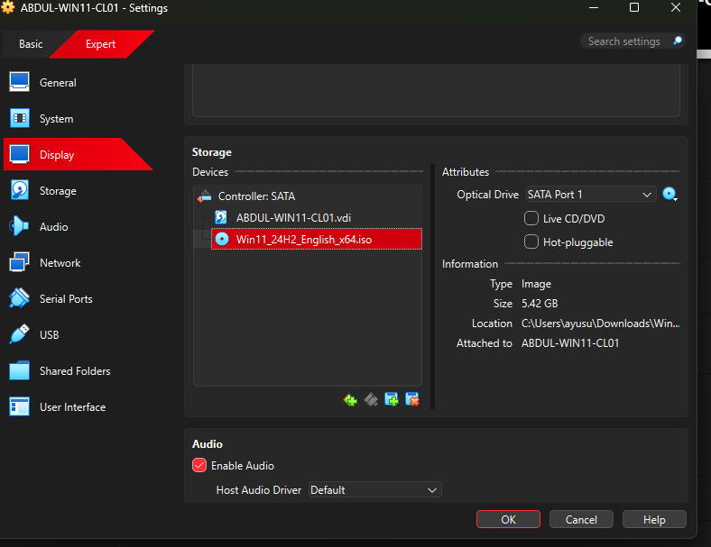
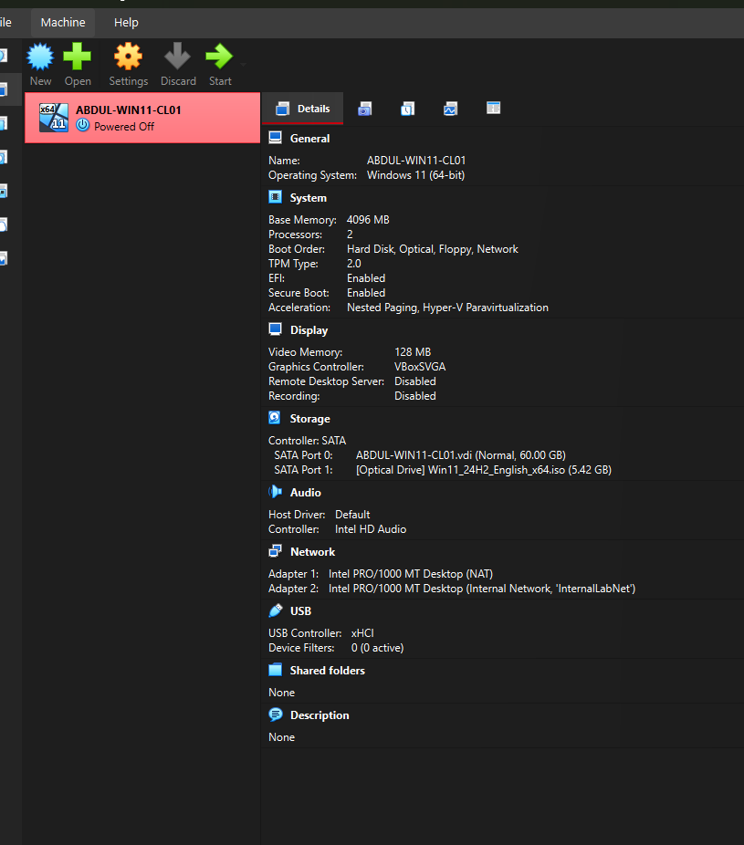

# VirtualBox Setup and VM Configuration

This project documents the process of installing and configuring **Oracle VirtualBox** to host virtual machines for IT lab environments.  
It focuses on preparing a Windows 11-compatible environment, configuring resources, and setting up proper networking for future OS installations.

---

## 🧠 Project Overview

The goal of this setup is to create a stable, enterprise-style virtualization platform that can host multiple guest operating systems for testing, system administration, and cybersecurity practice.

### Objectives

- Install and configure Oracle VirtualBox (v7.x)
- Create a new VM (`ABDUL-WIN11-CL01`)
- Allocate hardware (RAM, CPU, Disk) and enable **EFI Boot**
- Configure **NAT** and **Internal Network (InternalLabNet)** adapters
- Prepare the VM for future Windows installation

---

## 🧰 Tools & Requirements

| Component | Details |
|-----------|----------|
| **Host OS** | Windows 10 / 11 (64-bit) |
| **Virtualization Platform** | Oracle VirtualBox 7.x |
| **ISO Used** | Windows 11 Pro x64 (for setup testing) |
| **Memory** | 4 GB |
| **CPU** | 2 vCPU |
| **Disk Space** | 60 GB |
| **Network** | NAT + Internal Network |

---

## 🪜 Configuration Steps

### Step 1 — Install Oracle VirtualBox
Install Oracle VirtualBox 7.2.4 on your host system.  
This is the virtualization platform that enables you to run Windows 11 inside an isolated environment.  

---

### Step 2 — Create a New Virtual Machine
Open VirtualBox and click **New** to create a new VM.  
Enter the name `ABDUL-WIN11-CL01`, choose **Windows 11 (64-bit)**, and attach your downloaded Windows 11 ISO.  

---

### Step 3 — Configure Virtual Hardware
Allocate **4 GB of RAM**, **2 CPUs**, and **60 GB of disk space**.  
Enable **EFI** to ensure compatibility with Windows 11’s Secure Boot and UEFI mode.  

---

### Step 4 — Review VM Summary
Before finalizing, double-check all selected settings — hardware, EFI, and ISO attachment — for accuracy.  

---

### Step 5 — Enable Shared Features
Under **General → Advanced**, enable:  
- **Shared Clipboard:** Bidirectional  
- **Drag and Drop:** Bidirectional  
These options simplify file and text sharing between host and guest systems.  

---

### Step 6 — Configure Network Adapters
**Adapter 1 — NAT (Internet Access):**  
Provides the VM with external network connectivity for updates and downloads.  

**Adapter 2 — Internal Network (Lab Connectivity):**  
Set this to **Internal Network** and name it `InternalLabNet`.  
This allows communication between VMs in a safe, isolated environment.  

---

### Step 7 — Verify ISO Attachment
Go to **Settings → Storage**, and confirm the Windows 11 ISO file is properly mounted under the SATA controller.  
This ensures the VM can boot from installation media.  

---

### Step 8 — Final Review
Confirm all VM details before launching.  
Your summary should list: **4 GB RAM, 2 CPUs, EFI enabled, 60 GB disk, and dual network adapters**.  

---

✅ **Next Step:**  
Proceed to the [Windows 11 Installation Guide](../windows-installation/README.md) to begin the OS setup inside your new VM.

