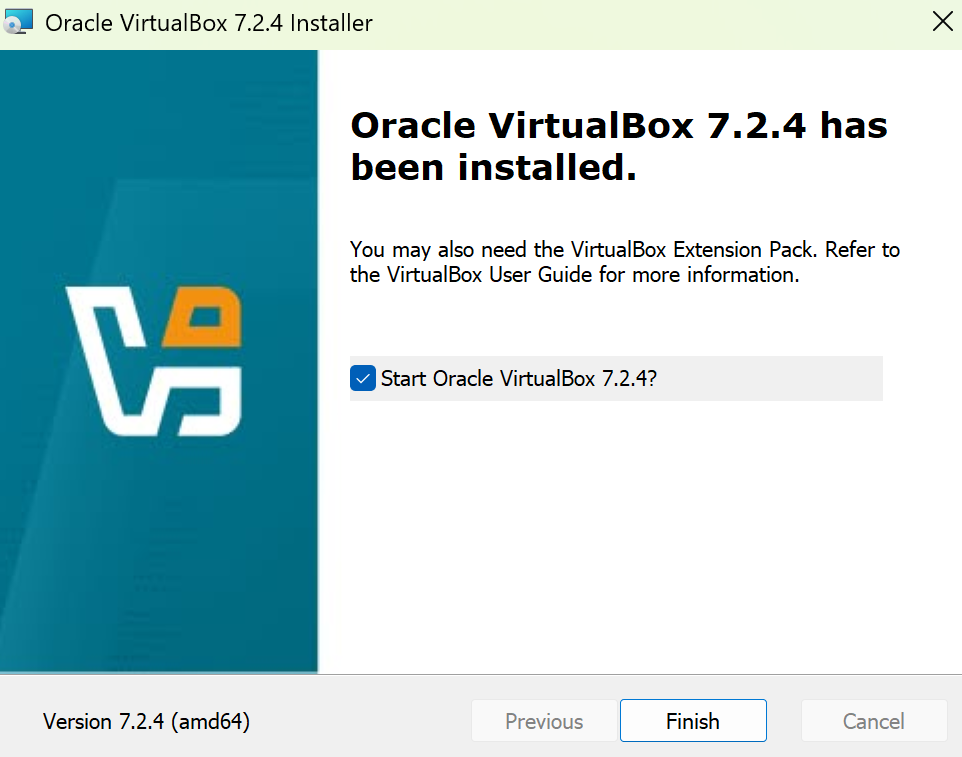
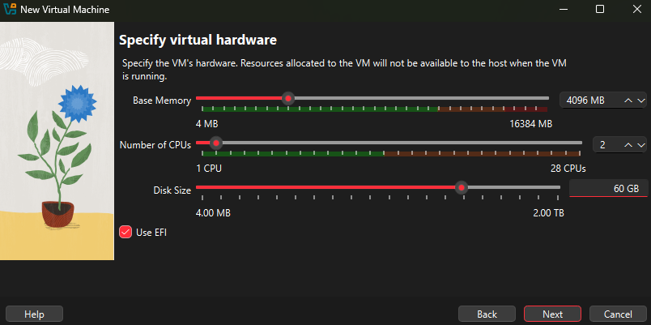

# VirtualBox Setup and VM Configuration

This project documents the process of installing and configuring **Oracle VirtualBox** to host virtual machines for IT lab environments.  
It focuses on preparing a Windows 11-compatible environment, configuring resources, and setting up proper networking for future OS installations.

---

## 🧠 Project Overview

The goal of this setup is to create a stable, enterprise-style virtualization platform that can host multiple guest operating systems for testing, system administration, and cybersecurity practice.

### Objectives

- Install and configure Oracle VirtualBox (v7.x)
- Create a new VM (`ABDUL-WIN11-CL01`)
- Allocate hardware (RAM, CPU, Disk) and enable **EFI Boot**
- Configure **NAT** and **Internal Network (InternalLabNet)** adapters
- Prepare the VM for future Windows installation

---

## 🧰 Tools & Requirements

| Component | Details |
|-----------|----------|
| **Host OS** | Windows 10 / 11 (64-bit) |
| **Virtualization Platform** | Oracle VirtualBox 7.x |
| **ISO Used** | Windows 11 Pro x64 (for setup testing) |
| **Memory** | 4 GB |
| **CPU** | 2 vCPU |
| **Disk Space** | 60 GB |
| **Network** | NAT + Internal Network |

---

## 🪜 Configuration Steps

### Step 1 — Install Oracle VirtualBox
Install VirtualBox on the host machine.  

### Step 2 — Create a New Virtual Machine
Create a new VM named `ABDUL-WIN11-CL01`, select **Windows 11 (64-bit)**, and attach the ISO image.  

### Step 3 — Specify Virtual Hardware
Assign 4 GB of RAM, 2 CPUs, and a 60 GB virtual hard disk. Enable EFI for modern boot support.  

### Step 4 — Review Summary
Double-check VM specs before creating.  

### Step 5 — Optimize Shared Settings
Enable **Shared Clipboard** and **Drag and Drop** in _Bidirectional_ mode for convenience.  

### Step 6 — Configure Networking
- **Adapter 1 (NAT):** For internet access  
  
- **Adapter 2 (Internal):** For lab connectivity  
  

---

## 🚀 Next
Proceed to [Windows 11 Installation](https://github.com/abdulyusuf-it/windows11-installation) to complete the OS setup inside your virtual machine.

